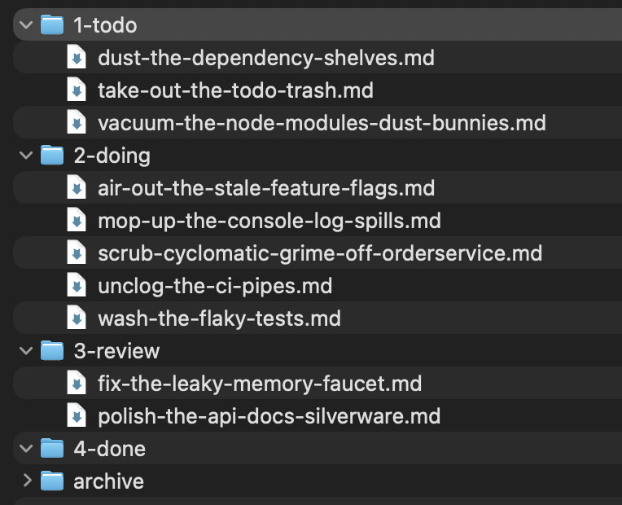
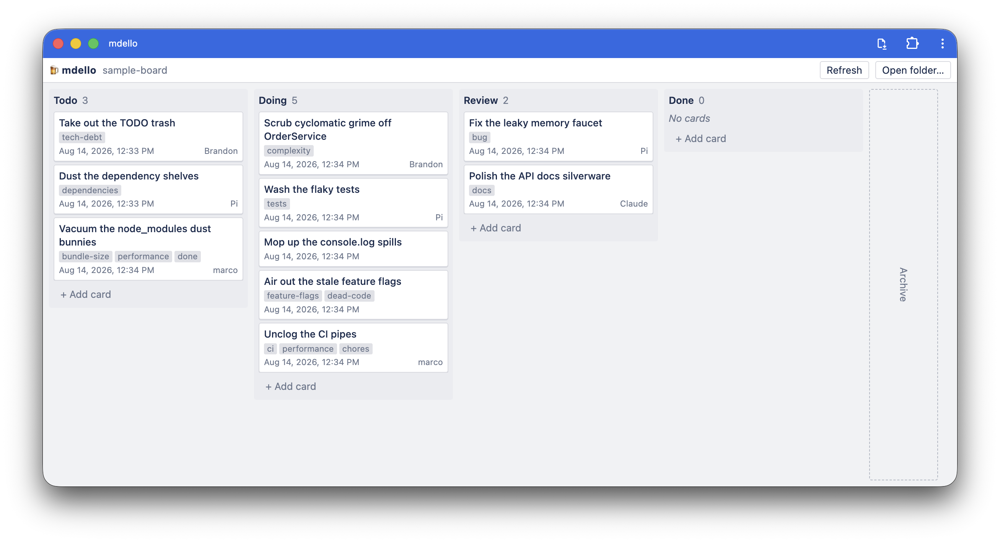

<p align="center">

</p>

Trello-style board that reads and writes plain markdown files on your local disk.

- 100% local, no server, no database.
- folders are columns, `.md` files are cards, frontmatter is metadata.
- Uses the Filesystem API, requires a [Chromium-based browser](https://caniuse.com/filesystem)
- Designed to share your personal TODOs with AI agents - No MCP, tools or auth needed.
- 🍻 Pronounced like the beer

**Try it out at https://subdavis.github.io/mdello/**

## User Guide

| Your files                              | Your board                                 |
| --------------------------------------- | ------------------------------------------ |
|  |  |

Mdello can be installed as a PWA.


Recommend creating the folder at `~/Documents/mdello`

Open the app, click **Open folder…**, pick your folder. The folder handle is cached in IndexedDB, so
later visits only need a single **Reconnect** click to re-grant write permission.

### Switching boards

Every folder you open is remembered. Press <kbd>⌘P</kbd> (<kbd>Ctrl</kbd>+<kbd>P</kbd>) or click the
board name in the toolbar to bring up the switcher: arrow keys to move, <kbd>Enter</kbd> to switch,
<kbd>Esc</kbd> to dismiss. Because the handles are cached, swapping boards never re-opens the file
picker. Boards are listed by their `path` from `mdello.yml` where one is set, since every board
folder tends to be called `content`. The **×** on a row drops it from the list and leaves the files
alone.

### Agent Skills

The purpose of the filesystem-based approach is to give AI agents complete access to your board without any external tools, MCP, or auth. It's just files! You can tell your agent about your board with a simple skill.

```bash
npx skills add https://github.com/subdavis/mdello/blob/main/skills/mdello-board
```

### Board layout

```
content/
  mdello.yml                # Local config file
  1-todo/card.md            # numeric prefix sets column order
  2-doing/card.md
  3-done/card.md
  archive/2026-08/card.md   # never scanned, never shown
```

### Frontmatter

- `title` is editable
- `order` is managed by drag order
- `tags`, `assignee` and `created` are read-only
- modification time comes from the file itself.

Editing: click a card to open it, double-click the description for a raw markdown editor. Changes
autosave after a short pause; **Save** exits edit mode and re-renders.

### Configuration & Customization

See `mdello.yml` in your mdello board folder to configure additional features

- Open-in-editor setup
- Tag customization

Drag any image onto the window to set the background image.

## Local development

```bash
mise install
yarn install
yarn dev
```
