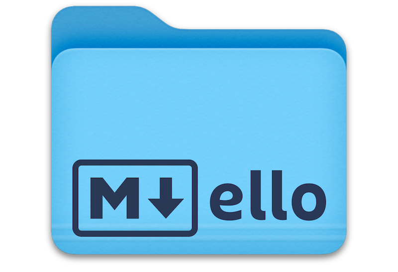
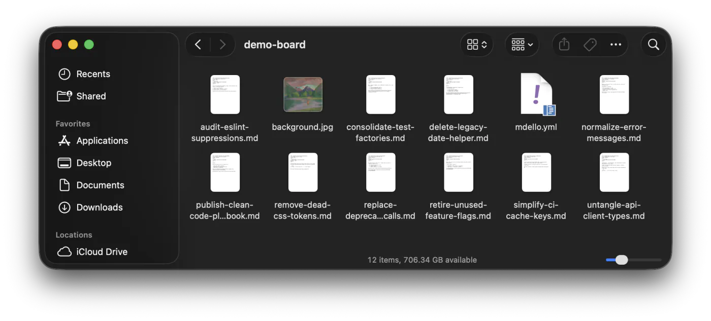
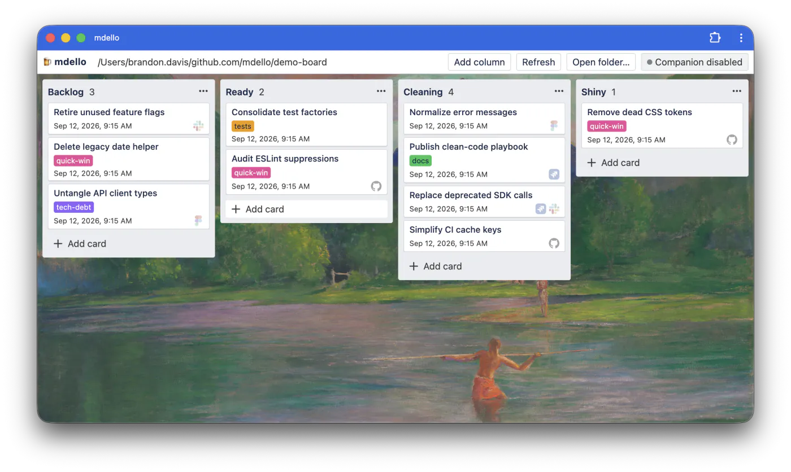
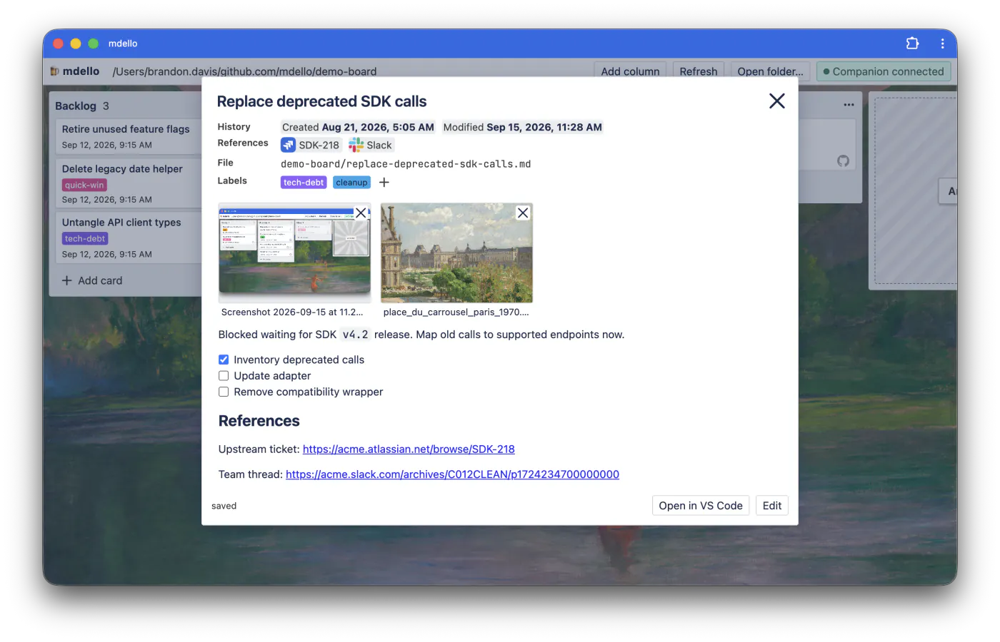
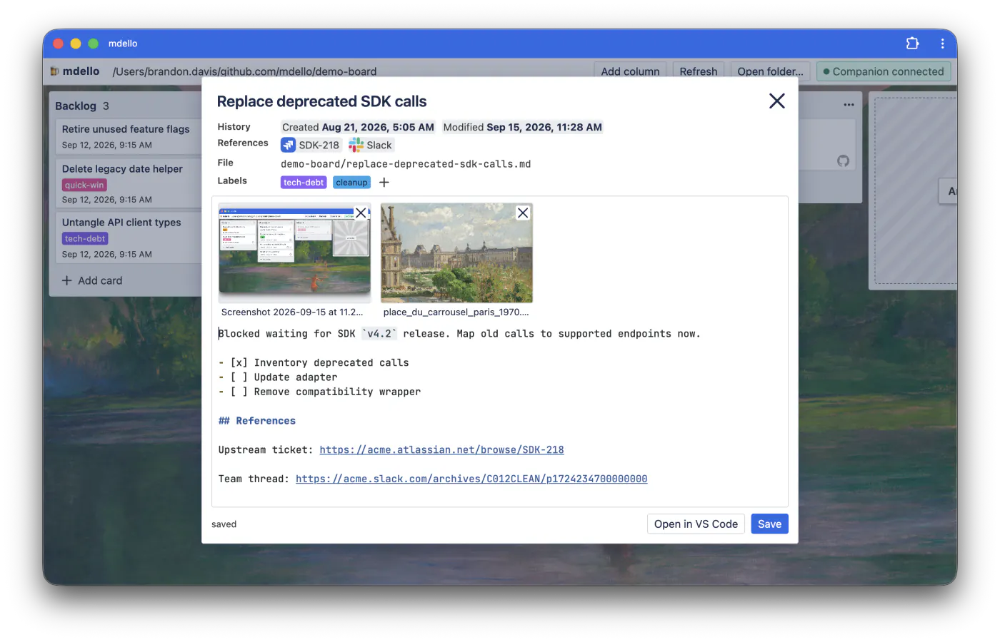

<p align="center">

</p>

> [!NOTE]
> A human wrote this README. Really! 😀

Trello-style board that reads and writes plain markdown files on your local disk.

- **100% local**. No install. Runs in the browser.
- `.md` files are cards, metadata lives in Frontmatter.
- **Uses the Filesystem API** and therefore requires a [Chromium-based browser](https://caniuse.com/filesystem)
- Designed to share your tasks with AI agents via the filesystem. - No MCP, tools or auth needed.
- 🍻 Pronounced like the beer

**Try it out at https://subdavis.github.io/mdello/**

## User Guide

| Screenshots                                                       | Screenshots                                                        |
| ----------------------------------------------------------------- | ------------------------------------------------------------------ |
|  |    |
|  |  |

Mdello can be installed as a PWA.


Basic usage:

- Recommend creating the folder at `~/.local/state/kanban-board`
- Open the app, click **Open folder…**, and pick your folder. If permissions are requested, grant them with "Don't ask again". Double-click the description for a raw markdown editor.
- **Attachments** - Drop files onto an open card to attach them. Files are stored centrally in `attachments/`. Each card tracks its files in frontmatter. Images appear as thumbnails above the description and open in a full-size viewer. Other file types open in the browser.

### Agent Skills

The purpose of the filesystem-based approach is to give AI agents complete access to your board without any external tools, MCP, or auth. It's just files! You can tell your agent about your board with a simple skill.

```bash
npx skills add https://github.com/subdavis/mdello/blob/main/skills/mdello-board
```

### Board layout

```txt
~/Documents/kanban-board/
  mdello.yml                # Config, including ordered columns
  fix-a-bug.md              # column selected by frontmatter
  ship-release.md
  archive/2026-08/card.md   # never scanned, never shown
```

### Keyboard Shortcuts

- <kbd>⌘P</kbd> (<kbd>Ctrl</kbd>+<kbd>P</kbd>) opens the switcher dialog
- <kbd>Esc</kbd> closes any open modal, card, or editor.

### Frontmatter

- `uuid` — stable identifier.
- `title` — falls back to filename minus `.md`
- `column` — required for display, matches `mdello.yml` column list
- `tags` — string list.
- `created` — ISO string or `YYYY-MM-DD`. Read-only in app.
- `order` — app-managed card position
- Modified time comes from filesystem.
- Extra frontmatter keys survive app round-trips.

### Board Configuration & Customization

- See `mdello.yml` in your mdello board folder.
- Drag any image onto the window to set the background.

## Companion integrations (optional)

The optional companion integration runs a local HTTP server and tracks agent sessions that associate with your cards. It provides live session indicators on the board and preserves historical session data. Associations are many-to-many between cards and sessions. With dozens of sessions flying around per day, I find this bookkeeping incredibly useful. YMMV.

```bash
git clone git@github.com:subdavis/mdello.git
cd mdello
yarn install
yarn build

# Install every integration
npx mdello-companion install

# Install specific integrations
npx mdello-companion install macos
npx mdello-companion install pi # Then run `/reload`
npx mdello-companion install claude # then run run `/reload-plugins`

# Learn more about the companion
npx mdello-companion help
```

| Integration | Installs                                                                           |
| ----------- | ---------------------------------------------------------------------------------- |
| `macos`     | `~/Library/LaunchAgents/com.mdello.companion.plist`, started with `launchctl`      |
| `pi`        | `packages/pi-extension/dist/index.js` symlinked into `~/.pi/agent/extensions`      |
| `claude`    | a plugin at `~/.claude/skills/mdello-companion` whose hooks post to the companion. |

- Every install command is safe to rerun and updates its existing installation.
- Companion configuration follows XDG paths: `${XDG_CONFIG_HOME:-~/.config}/mdello/companion.json`.
- Persistent association state and launch-agent logs use `${XDG_STATE_HOME:-~/.local/state}/mdello/`.

### Agent plugins

Agent extensions discover associations from absolute Markdown paths in user input and from successful Markdown edit or write tool calls. See [`docs/agent-extension.md`](docs/agent-extension.md) for the lifecycle event mapping and the contract a new harness must satisfy.

### Uninstall

Too many tools give

```bash
# Remove every integration
npx mdello-companion uninstall

# Remove specific integrations
npx mdello-companion {integration}
```

## Repository layout

This repository is a Yarn workspace monorepo:

- `packages/client` — Vue PWA deployed to GitHub Pages
- `packages/companion` — local sidecar and CLI; private until ready for npm
- `packages/pi-extension` — Pi lifecycle integration, loaded in-process by Pi
- `packages/claude-extension` — Claude Code hook adapter, imported by the companion
- `packages/common` — shared association, harness, frontmatter, and path helpers

## Local development

```bash
mise install
yarn install

# Run the frontend
yarn dev

# Run the companion in debug mode
DEBUG=1 yarn companion
```

## AI Use

- This project was built iteratively over a month. The design and feature choices reflect my ideas and preferences.
- Most of the code was indeed authored by AI (GPT Sol + Pi)
- With the exception of the CSS. I wrote about half of it by hand because I wanted it to look and feel a certain way, not like vibeslop. If you dislike the UI, it's because I personally have bad taste lol.
- More care has been taken with the frontend code because I have a strict understanding of what I want it to do. I'm realatively happy with it.
- Less care was taken with the companion, as I intend to eventually rewrite it once I understand my feature needs more.

## Design discussion and philosophy

So like, why is this even a good idea?

1. The filesystem is simply the best abstraction for working with agents. MCP requires special tools and setup, it is the worst. A command line tool is better. Files beat everything. Obsidian proved that Markdown+Frontmatter makes a formidable knowledge management system. I borrowed its ideas to make a dead simple kanban board.
1. Buidling "integrations" with mdello is trivial because mdello is not really software, it's just a set of conventions for files.
1. Electron/Tauri is needlessly heavy for this purpose. Chromium has everything this application needs. You don't have to worry about what files and processes a PWA is screwing around with without telling you. (Yes, I know the companion somewhat complicates this.)
1. Why is everyone trying to build all these single-pane-of-glass omni-agent apps anyway? I don't need my kanban tool to also be a code review tool or an agent multiplexer. It will be mediocre at all 3. Unix says you should do one thing well.
